<div align="center">

# 📚 Learning Tracker

**A full-stack Learning & Development (L&D) platform for assigning, tracking and evaluating employee training progress.**

Spring Boot · PostgreSQL · React · JWT Authentication

[](https://www.oracle.com/java/)
[](https://spring.io/projects/spring-boot)
[](https://react.dev/)
[](https://vitejs.dev/)
[](https://www.postgresql.org/)
[](https://flywaydb.org/)
[](#-license)

</div>

---

## 🖼️ Screenshots

<p align="center"><i>All screens below are pulled directly from <code>/assets</code>. Click any image to view it at full resolution.</i></p>
<p align="center"><a href="#-overview">Jump to full documentation ↓</a></p>

### 🔑 Authentication

<table>
<tr>
<td width="50%" align="center">
<a href="assets/01-login-screen.png">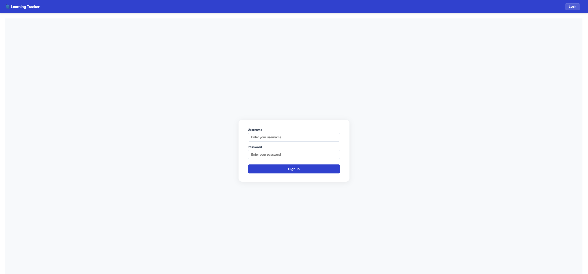</a>
<br/><sub><b>Login screen</b> — JWT-based sign-in for both employees and admins</sub>
</td>
</tr>
</table>

### 🛠️ Admin — User Management

<table>
<tr>
<td width="50%" align="center">
<a href="assets/02-admin-adding-user.png">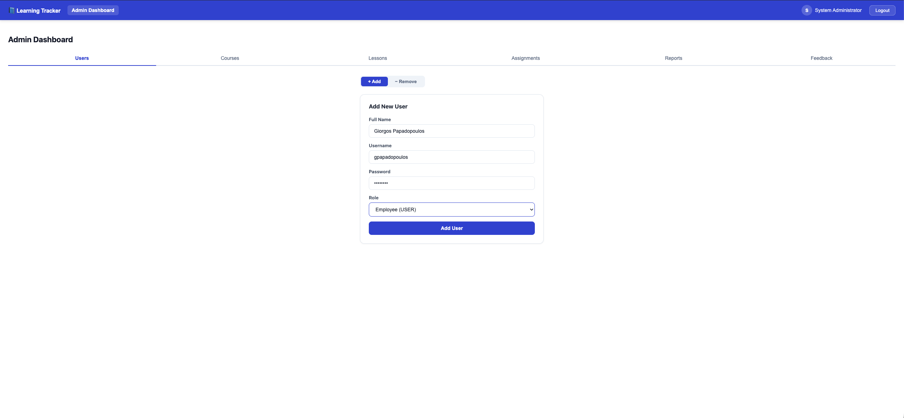</a>
<br/><sub><b>Adding a user</b> — creating a new employee account</sub>
</td>
<td width="50%" align="center">
<a href="assets/03-admin-deleting-user.png">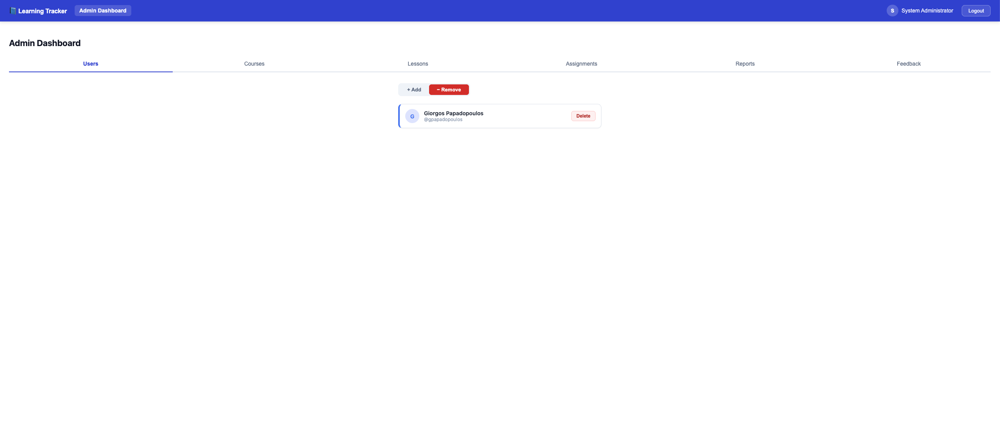</a>
<br/><sub><b>Deleting a user</b> — removing an employee account</sub>
</td>
</tr>
</table>

### 🛠️ Admin — Course Management

<table>
<tr>
<td width="50%" align="center">
<a href="assets/04-admin-adding-course.png">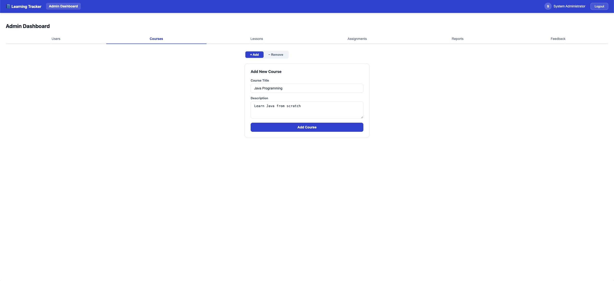</a>
<br/><sub><b>Adding a course</b> — creating a new training track</sub>
</td>
<td width="50%" align="center">
<a href="assets/05-admin-deleting-course.png">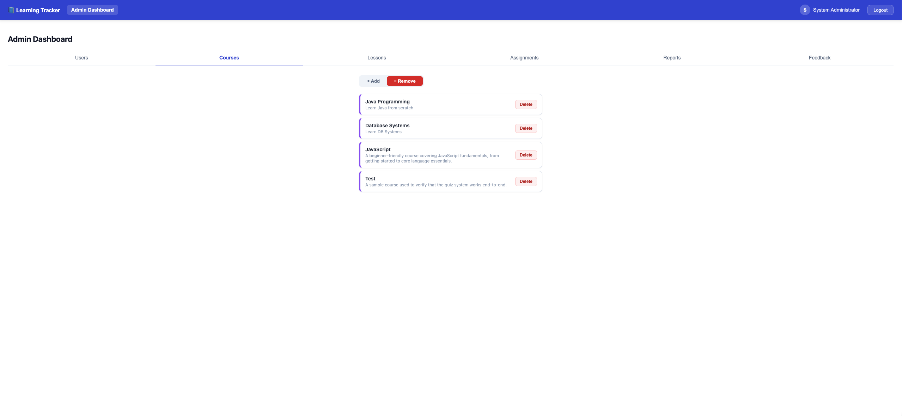</a>
<br/><sub><b>Deleting a course</b> — removing a training track</sub>
</td>
</tr>
</table>

### 🛠️ Admin — Lesson & Quiz Authoring

<table>
<tr>
<td width="50%" align="center">
<a href="assets/06-admin-adding-lesson.png">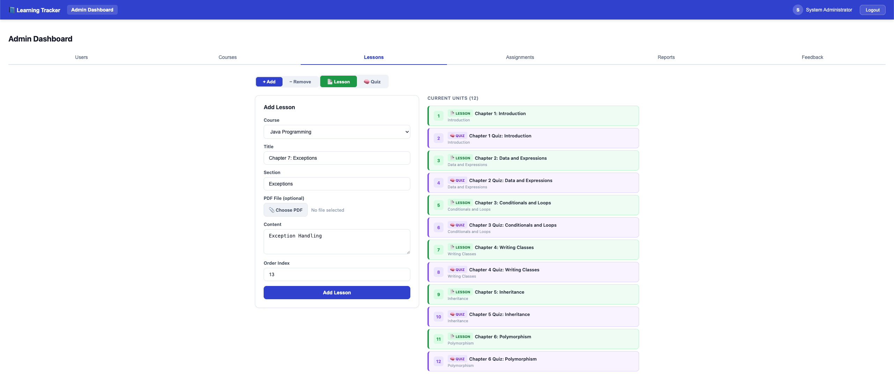</a>
<br/><sub><b>Adding a lesson</b> — uploading a PDF unit to a course</sub>
</td>
<td width="50%" align="center">
<a href="assets/07-admin-adding-quiz.png">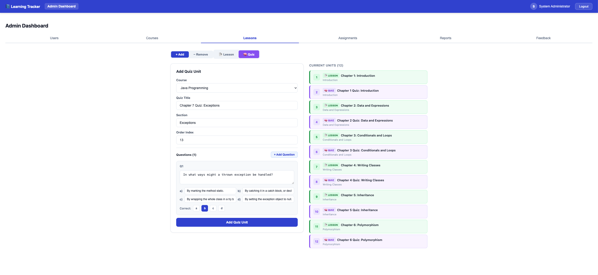</a>
<br/><sub><b>Adding a quiz</b> — building questions & multiple-choice options</sub>
</td>
</tr>
<tr>
<td width="50%" align="center">
<a href="assets/08-admin-remove-lesson-quiz.png">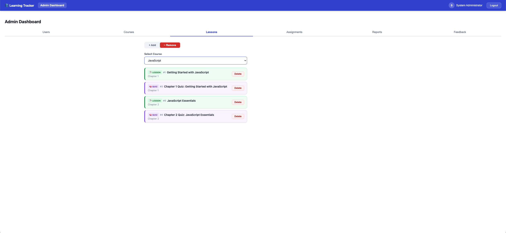</a>
<br/><sub><b>Removing a unit</b> — deleting a lesson or quiz from a course</sub>
</td>
</tr>
</table>

### 🛠️ Admin — Course Assignment

<table>
<tr>
<td width="50%" align="center">
<a href="assets/09-admin-assigning-course.png">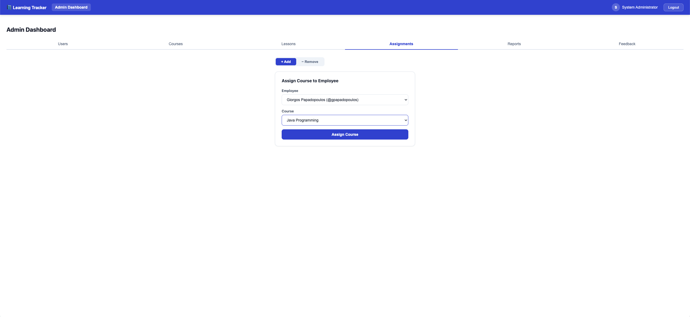</a>
<br/><sub><b>Assigning a course</b> — enrolling an employee in a course</sub>
</td>
<td width="50%" align="center">
<a href="assets/10-admin-unassigning-course.png">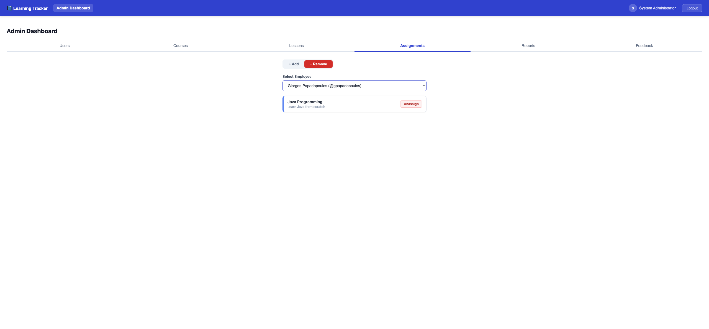</a>
<br/><sub><b>Unassigning a course</b> — removing an employee's enrollment</sub>
</td>
</tr>
</table>

### 🛠️ Admin — Reporting & Feedback

<table>
<tr>
<td width="50%" align="center">
<a href="assets/11-admin-reports-page.png">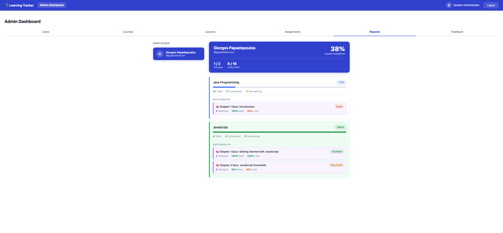</a>
<br/><sub><b>Reports page</b> — per-employee progress across all assigned courses</sub>
</td>
<td width="50%" align="center">
<a href="assets/12-admin-feedback-page.png">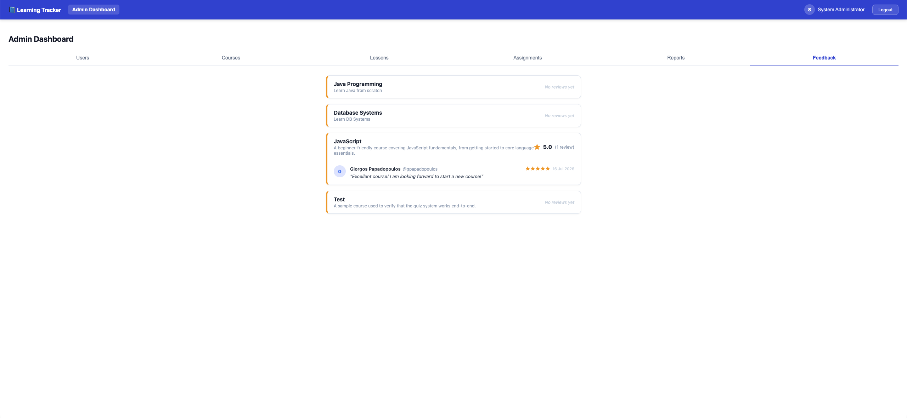</a>
<br/><sub><b>Feedback page</b> — aggregated employee ratings & comments per course</sub>
</td>
</tr>
</table>

### 👤 Employee Experience

<table>
<tr>
<td width="50%" align="center">
<a href="assets/13-user-course-page.png">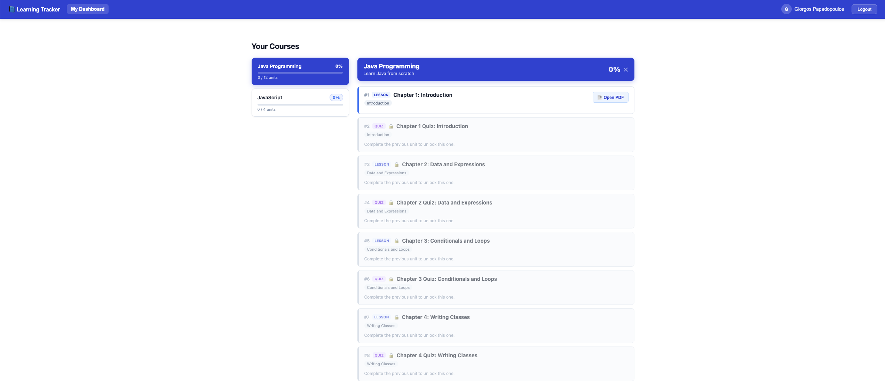</a>
<br/><sub><b>Course page</b> — assigned courses with live completion progress</sub>
</td>
<td width="50%" align="center">
<a href="assets/18-user-feedback-page.png">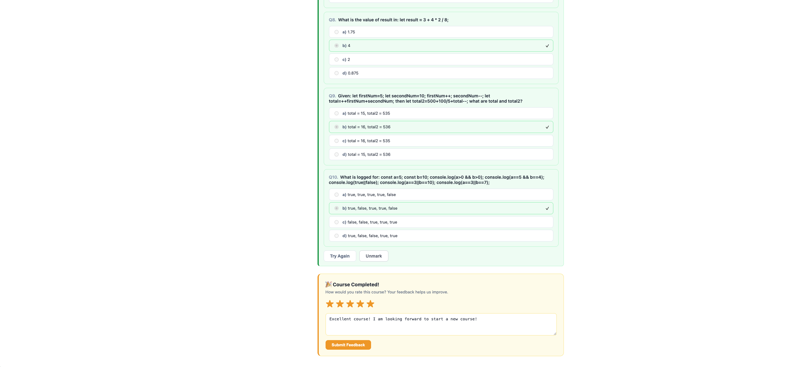</a>
<br/><sub><b>Feedback submission</b> — rating and commenting on a completed course</sub>
</td>
</tr>
</table>

### 👤 Employee — Quiz Section

<table>
<tr>
<td width="50%" align="center">
<a href="assets/14-user-quiz-section.png">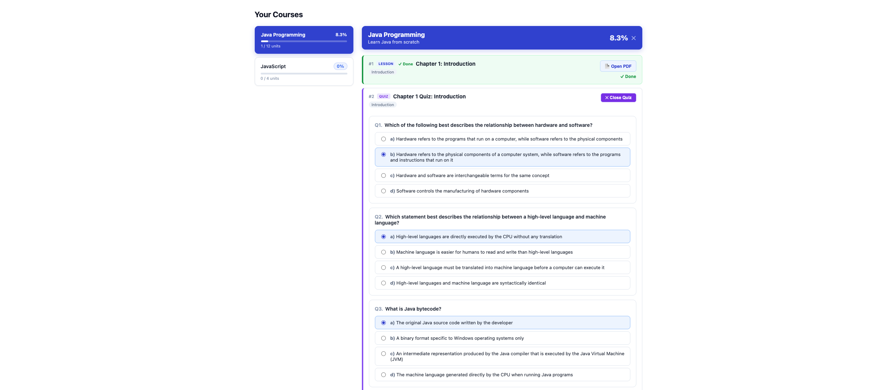</a>
<br/><sub><b>Taking a quiz</b> — answering multiple-choice questions</sub>
</td>
<td width="50%" align="center">
<a href="assets/15-user-quiz-section.png">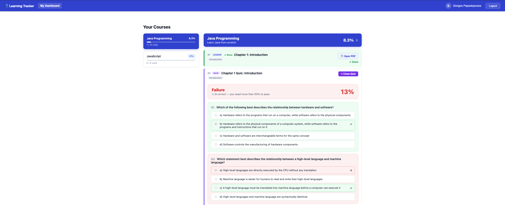</a>
<br/><sub><b>Quiz in progress</b></sub>
</td>
</tr>
<tr>
<td width="50%" align="center">
<a href="assets/16-user-quiz-section.png">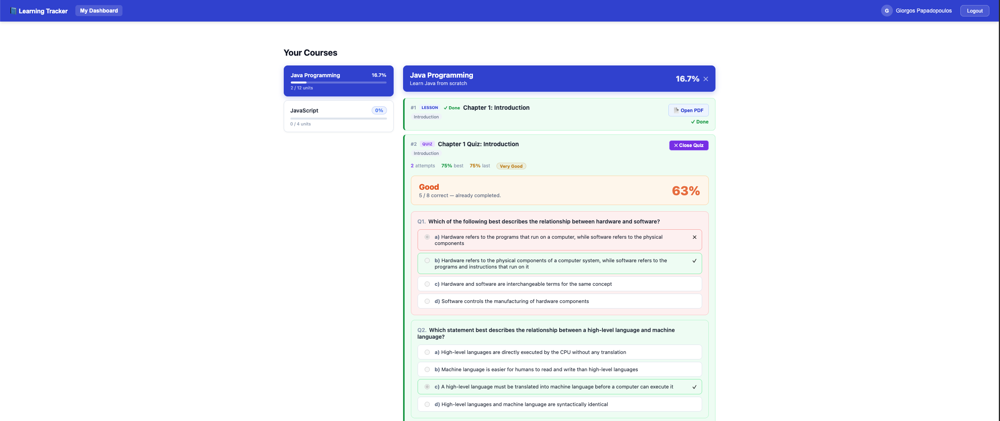</a>
<br/><sub><b>Quiz results</b> — score feedback after submission</sub>
</td>
<td width="50%" align="center">
<a href="assets/17-user-quiz-section.png">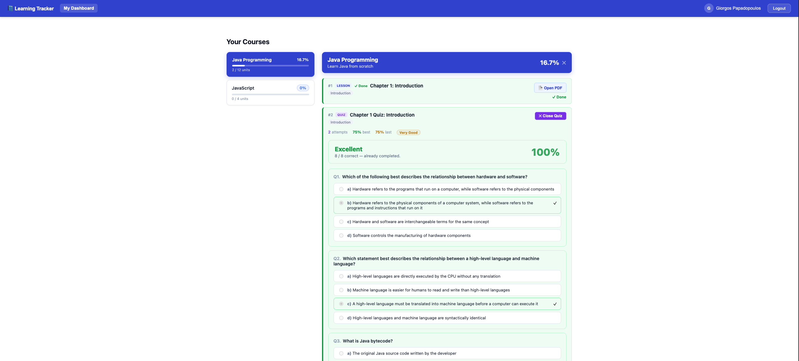</a>
<br/><sub><b>Past attempt summaries</b> — reviewing quiz history</sub>
</td>
</tr>
</table>


---

## 📖 Overview

**Learning Tracker** is an internal L&D platform built to solve a very concrete problem: how do you assign structured training material (courses, lessons, quizzes) to employees and then actually **know** who has completed what, how well they scored and what they thought of it?

The system is split into two independently deployable pieces that talk to each other over a REST API:

- A **Spring Boot backend** exposing a secured REST API, backed by **PostgreSQL** with version controlled schema migrations (**Flyway**), handling authentication, course/lesson/quiz management, progress tracking and reporting.
- A **React (Vite) frontend**, a single-page app with two distinct experiences, one for `ADMIN` users who build and manage the training catalog and one for `USER` (employee) accounts who consume it.

Everything below, every screen, every endpoint, every table reflects what is actually implemented in this repository.

---

## 🧑‍🤝‍🧑 Roles & Permissions

Authorization is role based and enforced via Spring Security using a JWT bearer token. Every authenticated request carries a `ROLE_USER` or `ROLE_ADMIN` authority resolved from the `users.role` column.

| Role | Can do |
|---|---|
| 👤 **USER** (employee) | Log in · view assigned courses · view progress per course · read lessons (PDF viewer) · mark units complete / unmark them · take quizzes and get scored · review past quiz-attempt summaries · leave star-rated feedback + comments on a course · change their own password |
| 🛠️ **ADMIN** | Everything a USER can do, **plus**: create/delete courses · create/delete lesson units and quiz units · upload/replace/remove lesson PDFs · build quiz questions & multiple-choice options · create/delete employee accounts · assign/unassign courses to employees · view per-employee progress reports · view aggregated feedback per course |

---

## ✨ Features

### 🔐 Authentication & Security
- Stateless **JWT authentication** (`io.jsonwebtoken` / `jjwt`) — login returns a signed access token consumed on every subsequent request via an `Authorization: Bearer <token>` header.
- Custom `OncePerRequestFilter` (`JwtAuthenticationFilter`) validates the token and populates the Spring Security context on every request.
- Passwords are never stored or compared in plaintext unsafe ways, handled through Spring Security's password encoding.
- Self-service **password change** endpoint, requiring the current password before accepting a new one.

### 📂 Course & Curriculum Management (Admin)
- Full CRUD on **courses** (currently seeded with **Java**, **JavaScript** and **Databases** tracks).
- Courses are broken down into **units**, which can be either:
  - **Lesson units** a PDF document uploaded and stored directly in the database (`bytea`/BLOB column), served back to the frontend on demand.
  - **Quiz units** a set of questions, each with multiple-choice options and a correct answer.
- Admins can **remove** any lesson or quiz unit from a course at any time.
- **Assign** a course to one or more employees, or **unassign** it if it's no longer relevant.

### ✅ Progress Tracking
- Employees can mark a unit as **complete** or **unmark** it, with progress persisted per `(user, unit)` pair.
- The employee's course list shows **live completion progress** for every assigned course.
- Admins can pull a full **progress report** for any employee every assigned course and how far along they are.

### 📝 Quizzes & Scoring
- Quiz units support **multiple questions**, each with **multiple-choice options** and a single correct answer.
- Employees submit answers and receive an **immediate score**.
- Every attempt is persisted; employees can review a **history of past quiz attempt summaries** at any time.

### 💬 Feedback
- After engaging with a course, employees can submit **star rated feedback with comments**.
- Admins can view **all feedback submitted for a course**, aggregated on a dedicated feedback page.

### 👥 User Management (Admin)
- Create new employee accounts (username, full name, role, password).
- Delete employee accounts.
- List all employees and drill into any one of them for a detailed report.

### 🗃️ Data & Documentation
- **Database-driven course content** lessons, quizzes, and their relationships all live in PostgreSQL, evolved safely through **10 Flyway migrations** (schema, seed data, quiz schema, per-language course seeds, quiz results, feedback and PDF in database storage).
- **Interactive, always up to date API documentation** via **Swagger / OpenAPI** (springdoc).
- **Docker Compose** file to spin up a local PostgreSQL instance in one command.

---

## 🏗️ Tech Stack

| Layer | Technology |
|---|---|
| **Language** | Java 17 |
| **Backend framework** | Spring Boot 3.4.3 (Web, Data JPA, Security, Validation, Actuator) |
| **Database** | PostgreSQL 16 |
| **Migrations** | Flyway (`flyway-core` + `flyway-database-postgresql`) |
| **Auth** | JWT (`jjwt-api` / `jjwt-impl` / `jjwt-jackson` 0.12.6) |
| **Object mapping** | MapStruct 1.6.3 + Lombok (with `lombok-mapstruct-binding`) |
| **API docs** | springdoc-openapi-starter-webmvc-ui 2.7.0 (Swagger UI) |
| **Frontend framework** | React 18 |
| **Routing** | React Router DOM 6 |
| **Build tool** | Vite 5 |
| **HTTP client** | Axios |
| **Containerization** | Docker / Docker Compose (PostgreSQL) |

---

## 📁 Project Structure

```
learning-tracker/
├── assets/                        # README screenshots
├── backend/                       # Spring Boot REST API
│   ├── src/main/java/com/learning/tracker/
│   │   ├── config/                 # App-level configuration
│   │   ├── controller/             # AuthController, CourseController, EmployeeController, UserController
│   │   ├── dto/                    # Data transfer objects (Course, Unit, Quiz, Feedback, Progress...)
│   │   ├── mapper/                 # MapStruct entity <-> DTO mappers
│   │   ├── model/                  # JPA entities (Course, Unit, User, UserCourse, QuizQuestion, QuizOption, QuizResult, CourseFeedback, UserUnitProgress)
│   │   ├── repository/             # Spring Data JPA repositories
│   │   ├── security/               # JwtAuthenticationFilter, JwtTokenProvider, CustomUserDetailsService
│   │   └── service/                # LearningService — core business logic
│   ├── src/main/resources/
│   │   ├── application.properties
│   │   ├── db/migration/            # V1...V10 Flyway SQL migrations
│   │   └── lessons/                  # Legacy seeded PDF lessons (java / javaScript / database)
│   ├── docker-compose.yaml           # Local PostgreSQL container
│   └── pom.xml
└── frontend/                       # React (Vite) SPA
    ├── src/
    │   ├── pages/
    │   │   ├── Login.jsx
    │   │   ├── UserDashboard.jsx
    │   │   ├── AdminDashboard.jsx
    │   │   └── Settings.jsx
    │   ├── App.jsx
    │   └── main.jsx
    ├── index.html
    ├── vite.config.js
    └── package.json
```

---

## 🚀 Getting Started

### Prerequisites

- [Java 17+](https://adoptium.net/)
- [Maven](https://maven.apache.org/) (or the included `mvnw` wrapper, if present)
- [Node.js 18+](https://nodejs.org/) and npm
- [Docker](https://www.docker.com/) & Docker Compose

### 1. Clone the repository

```bash
git clone https://github.com/NikosKatrakoulis/learning-tracker.git
cd learning-tracker
```

### 2. Start the database

```bash
cd backend
docker compose up -d
```

This spins up a PostgreSQL 16 container on `localhost:5432` with:
- database: `learning_tracker`
- user / password: `root` / `root`

> ⚠️ These are local development defaults defined in `docker-compose.yaml`. Override them via environment variables or a separate `application-prod.properties` profile before deploying anywhere real.

### 3. Run the backend

```bash
# from the backend/ directory
mvn spring-boot:run
```

Flyway automatically applies all 10 migrations in `db/migration` on startup, seeding the database with sample courses (Java, JavaScript, Databases), lessons, quiz questions and demo users.

The API will be available at **`http://localhost:8080`**, with interactive documentation at:

```
http://localhost:8080/swagger-ui.html
```

### 4. Run the frontend

```bash
cd frontend
npm install
npm run dev
```

The SPA will be available at **`http://localhost:5173`** by default (Vite's default dev port) and it talks to the backend via Axios.

---

## 🔌 API Reference

All endpoints are prefixed with `/api`. Every route **except `/api/auth/login`** requires a valid `Authorization: Bearer <jwt>` header. Routes annotated *(admin)* additionally require the `ADMIN` role.

### Auth

| Method | Endpoint | Description |
|---|---|---|
| `POST` | `/api/auth/login` | Authenticate with `username` + `password`, returns `accessToken`, `id`, `username`, `role`, `fullName` |

### Courses

| Method | Endpoint | Description |
|---|---|---|
| `GET` | `/api/courses` | List all courses |
| `POST` | `/api/courses` | Create a course *(admin)* |
| `DELETE` | `/api/courses/{courseId}` | Delete a course *(admin)* |
| `GET` | `/api/courses/{courseId}/units` | List all units (lessons + quizzes) belonging to a course |
| `POST` | `/api/courses/{courseId}/units` | Create a lesson unit under a course *(admin)* |
| `DELETE` | `/api/courses/units/{unitId}` | Delete a unit *(admin)* |
| `POST` | `/api/courses/{courseId}/quiz-units` | Create a quiz unit (questions + options) under a course *(admin)* |
| `GET` | `/api/courses/units/{unitId}/quiz` | Fetch the quiz questions/options for a unit |
| `GET` | `/api/courses/units/{unitId}/pdf` | Stream a unit's lesson PDF (from DB, or classpath fallback for legacy seeded lessons) |
| `POST` | `/api/courses/units/{unitId}/pdf` | Upload/replace a unit's lesson PDF (multipart `file`) *(admin)* |
| `GET` | `/api/courses/{courseId}/feedback` | List all feedback submitted for a course *(admin)* |

### Users

| Method | Endpoint | Description |
|---|---|---|
| `POST` | `/api/users` | Create a new user account *(admin)* |
| `DELETE` | `/api/users/{userId}` | Delete a user account *(admin)* |
| `PUT` | `/api/users/{userId}/password` | Change a user's password (requires `oldPassword` + `password`) |
| `GET` | `/api/users/{userId}/progress` | Get a user's unit-level completion progress |
| `GET` | `/api/users/{userId}/courses` | List a user's assigned courses, with progress |
| `GET` | `/api/users/{userId}/courses/unassigned` | List courses **not yet** assigned to a user *(admin)* |
| `POST` | `/api/users/{userId}/courses/{courseId}` | Assign a course to a user *(admin)* |
| `DELETE` | `/api/users/{userId}/courses/{courseId}` | Unassign a course from a user *(admin)* |
| `POST` | `/api/users/{userId}/units/{unitId}/complete` | Mark a unit as complete |
| `POST` | `/api/users/{userId}/units/{unitId}/unmark` | Mark a unit as incomplete |
| `POST` | `/api/users/{userId}/units/{unitId}/quiz-result` | Submit a quiz attempt and get it scored |
| `GET` | `/api/users/{userId}/quiz-summaries` | List a user's past quiz-attempt summaries |
| `POST` | `/api/users/{userId}/courses/{courseId}/feedback` | Submit star rating + comment for a course |
| `GET` | `/api/users/{userId}/courses/{courseId}/feedback` | Get a user's own feedback for a course |

### Employees (Admin reporting)

| Method | Endpoint | Description |
|---|---|---|
| `GET` | `/api/employees` | List all employees *(admin)* |
| `GET` | `/api/employees/{userId}/report` | Full progress report for an employee — all assigned courses & completion status *(admin)* |

> 💡 For request/response schemas and to try endpoints live, run the backend and open **Swagger UI** at `/swagger-ui.html`.

---

## 🗄️ Database Schema & Migrations

The schema is entirely managed by **Flyway**, with every change tracked as an incremental, immutable migration in `backend/src/main/resources/db/migration`:

| Migration | Purpose |
|---|---|
| `V1__init_schema.sql` | Base schema — users, courses, units |
| `V2__seed_data.sql` | Initial seed data |
| `V3__quiz_schema.sql` | Quiz questions & multiple-choice options schema |
| `V4__java_course_seed.sql` | Seeded **Java** course content |
| `V5__quiz_results.sql` | Quiz attempt/result tracking schema |
| `V6__database_course_seed.sql` | Seeded **Databases** course content |
| `V7__javascript_course_seed.sql` | Seeded **JavaScript** course content |
| `V8__course_feedback.sql` | Course feedback (ratings + comments) schema |
| `V9__replace_react_with_test_course.sql` | Replaced a legacy course with a test course |
| `V10__pdf_in_database.sql` | Migrated lesson PDFs from classpath storage into the database |

**Core entities:** `User`, `Course`, `Unit`, `UserCourse` (assignment + progress link), `UserUnitProgress`, `QuizQuestion`, `QuizOption`, `QuizResult`, `CourseFeedback`.

---

## 🤝 Contributing

Contributions are welcome! To contribute:

1. Fork the repository
2. Create a feature branch (`git checkout -b feature/amazing-feature`)
3. Commit your changes (`git commit -m 'Add some amazing feature'`)
4. Push to the branch (`git push origin feature/amazing-feature`)
5. Open a Pull Request

---

## 📄 License

This project is licensed under the [MIT License](LICENSE).

---

## 👤 Author

**Nikos Katrakoulis**
[GitHub @NikosKatrakoulis](https://github.com/NikosKatrakoulis)
